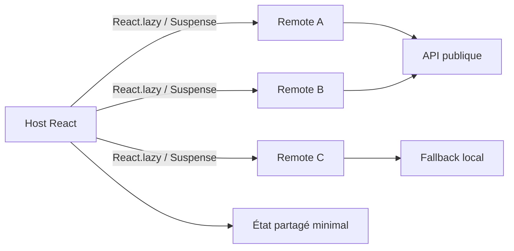

# Micro Frontends Showcase

Collection de projets frontend réalistes construits avec React 18, Webpack 5 Module Federation et Bootstrap 5.

L'objectif est de montrer comment découper une expérience complète en plusieurs applications autonomes, tout en conservant une navigation et une expérience utilisateur cohérentes.

## Contenu du dépôt

### Labs

Les exercices et démonstrations progressives se trouvent dans le dossier `labs/`.

### Projets réalistes

| Projet | Host | Remotes | API principale |
|---|---:|---|---|
| [World Dashboard](./real-world-projects/world-dashboard) | 9100 | Countries, Weather, Details, Statistics | REST Countries, Open-Meteo, World Bank |
| [Movie Platform](./real-world-projects/movie-platform) | 9200 | Movies List, Details, Favorites, Search | TMDB avec mocks locaux |
| [News Portal](./real-world-projects/news-portal) | 9300 | Headlines, Details, Categories, Bookmarks | Hacker News Algolia |
| [Fake Amazon](./real-world-projects/fake-amazon) | 9400 | Products, Details, Cart, Checkout | DummyJSON Products |
| [Recipes App](./real-world-projects/recipes-app) | 9500 | Recipes List, Details, Favorites, Meal Planner | TheMealDB |
| [Travel Dashboard](./real-world-projects/travel-dashboard) | 9600 | Destinations, Weather, Currency, Trip Planner | REST Countries, Open-Meteo, Frankfurter |
| [GitHub Dashboard](./real-world-projects/github-dashboard) | 9700 | Profile, Repositories, Details, Activity | GitHub REST API |
| [Task Manager](./real-world-projects/task-manager) | 9800 | Tasks, Details, Activity | JSONPlaceholder |

## Architecture commune

Chaque projet est indépendant et possède :

- une application Host responsable de l'orchestration ;
- au moins trois Remotes autonomes ;
- un `remoteEntry.js` produit par Webpack Module Federation ;
- React.lazy et Suspense pour le chargement distant ;
- React et React DOM partagés en singleton ;
- Bootstrap 5 et Bootstrap Icons ;
- une couche `services/api.js` avec timeout AbortController ;
- des états loading, empty, error et fallback local ;
- un README et des scripts d'installation, de démarrage et de build.



Les Remotes ne communiquent jamais directement entre eux. Le Host transmet les données par props et callbacks. Les données locales, favoris, paniers ou plannings sont persistés dans `localStorage` lorsque le cas d'usage le nécessite.

## Prérequis

- Node.js 18 ou plus récent ;
- npm ;
- un navigateur moderne ;
- une connexion Internet facultative pour les APIs, car chaque projet possède des données de secours.

## Installation et lancement

Chaque projet se lance depuis son propre dossier. Exemple avec `task-manager` :

```powershell
cd real-world-projects/task-manager
npm install
npm run install:all
npm run start:all
```

Puis ouvrir [http://localhost:9800/](http://localhost:9800/).

Les commandes communes sont :

```text
npm run install:all   Installer les dépendances du Host et des Remotes
npm run start:all     Démarrer toutes les applications
npm run build:all     Construire les applications séquentiellement
```

Pour lancer une application seule :

```powershell
npm.cmd --prefix tasks-app start
```

Les ports précis et les variables d'environnement sont documentés dans le README de chaque projet. Les fichiers `.env` sont ignorés par Git ; seuls les `.env.example` sont versionnés.

## Module Federation

Le Host déclare les Remotes avec leurs URLs locales :

```js
remotes: {
  tasksApp: "tasksApp@http://localhost:9801/remoteEntry.js"
}
```

Chaque Remote expose un composant React indépendant. Le fichier `src/index.js` contient uniquement le chargement différé de `bootstrap.js`, ce qui permet de partager correctement React et React DOM sans utiliser `eager: true`.

## APIs, sécurité et résilience

- aucune clé ou donnée sensible n'est stockée dans le code ;
- les tokens optionnels sont lus depuis `.env` ;
- les requêtes utilisent un timeout et `AbortController` ;
- les réponses HTTP invalides sont transformées en messages compréhensibles ;
- chaque projet possède un fallback local crédible ;
- les URLs externes sont utilisées avec `rel="noopener noreferrer"` ;
- le rendu React échappe naturellement les textes utilisateur ;
- aucune utilisation de `dangerouslySetInnerHTML`.

## Validation

Pour valider un projet :

1. installer ses dépendances ;
2. lancer `npm run build:all` ;
3. démarrer `npm run start:all` ;
4. vérifier le Host et chaque `remoteEntry.js` ;
5. tester loading, erreur, fallback, état vide, navigation et responsive.

Les avertissements de taille liés à Bootstrap et Bootstrap Icons peuvent apparaître pendant le build. Ils ne bloquent pas la compilation ni l'exécution.

## Pourquoi ce dépôt est utile comme référence Micro-Frontend

Cette collection couvre plusieurs formes d'état partagé : sélection d'un élément, favoris, panier, planning, recherche, filtres et persistance locale. Elle montre aussi l'orchestration d'applications indépendantes, la communication Host/Remote, le lazy loading, la gestion des APIs instables, les fallbacks, la résilience réseau et le build séparé de chaque module.

Chaque projet peut être étudié seul, mais l'ensemble permet de comparer plusieurs domaines métier avec la même architecture technique.

## Améliorations possibles

- ajouter des tests unitaires et E2E avec Playwright ;
- ajouter une CI GitHub Actions pour installer et builder chaque projet ;
- remplacer les mocks par un backend de démonstration contrôlé ;
- ajouter une stratégie de versionnement des Remotes ;
- publier les Hosts et Remotes sur des environnements séparés.
