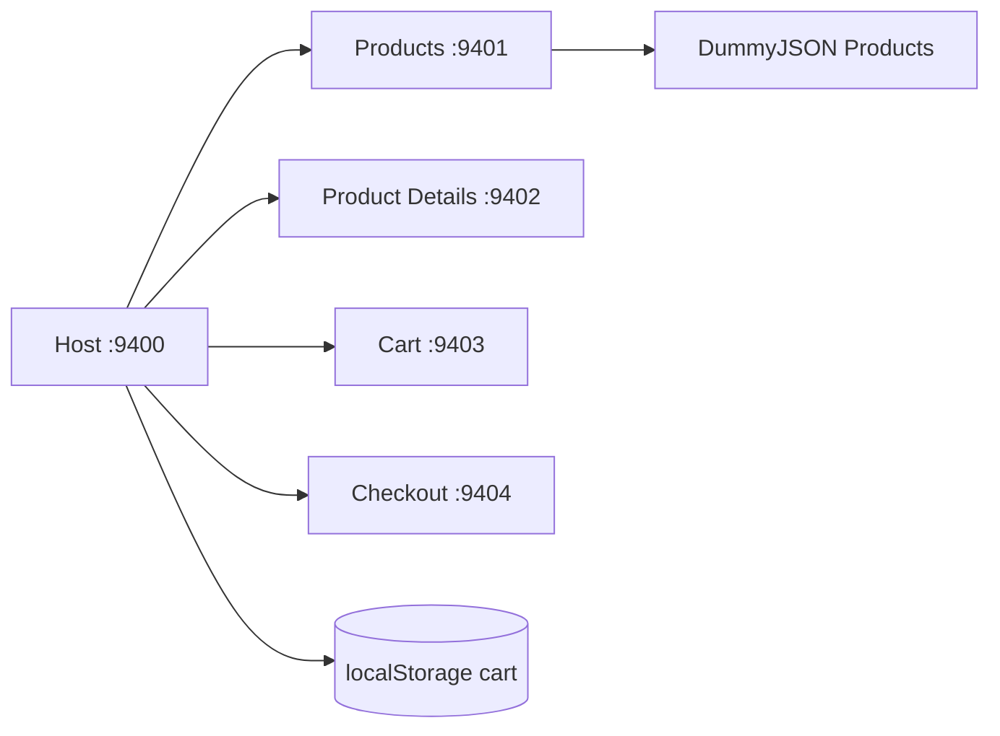

# Fake Amazon

Application e-commerce pedagogique composee d'un Host et de quatre Remotes React 18 avec Webpack 5 Module Federation et Bootstrap 5.

## Architecture



Le Host garde le produit courant et le panier. Les Remotes communiquent seulement par props et callbacks, ce qui preserve leur independance.

| Application | Port | Exposition |
|---|---:|---|
| host-app | 9400 | orchestration |
| products-app | 9401 | `productsApp/Products` |
| product-details-app | 9402 | `productDetailsApp/ProductDetails` |
| cart-app | 9403 | `cartApp/Cart` |
| checkout-app | 9404 | `checkoutApp/Checkout` |

## Fonctionnalites

Catalogue searchable, categories, tri par prix ou note, details, stock, panier persistant, quantites, suppression, total, formulaire d'adresse et paiement simule. Aucun paiement reel n'est integre.

## API

DummyJSON Products est une API publique sans cle. Elle fournit produits, prix, images, categories, rating et pagination via `limit`/`skip`. La couche API utilise `AbortController`, timeout, controle HTTP et fallback local. Documentation : https://dummyjson.com/docs/products.

## Installation

Prerequis : Node.js 18+ et npm.

```powershell
npm.cmd install
npm.cmd run install:all
npm.cmd run start:all
```

Host : `http://localhost:9400`. Les Remotes sont sur 9401 a 9404. Build sequentiel : `npm.cmd run build:all`.

## Variables d'environnement

Copier `.env.example` vers `.env` pour modifier `PRODUCTS_API_BASE_URL` ou `PRODUCTS_API_TIMEOUT`. Aucun secret n'est requis et `.env` est ignore par Git.

## Etats et securite

Chaque Remote gere loading, erreur, fallback et empty state. Les champs checkout sont valides nativement, React echappe les textes, les URLs externes utilisent `noopener noreferrer`, et aucune carte bancaire n'est envoyee.

## Captures a ajouter

- catalogue desktop et mobile ;
- detail avec ajout au panier ;
- panier avec quantites ;
- confirmation du paiement simule ;
- fallback API.

## Pourquoi ce projet est utile comme reference Micro-Frontend

Il demontre l'orchestration d'un parcours e-commerce, l'etat partage du panier, la communication par callbacks, l'independance des Remotes, la resilience API, le lazy loading, la persistance locale et les builds autonomes.

## Depannage et checklist

Verifier les ports 9400-9404 et les `remoteEntry.js`. Si DummyJSON est indisponible, le catalogue local doit rester visible. Tester la recherche, le detail, ajout, suppression, quantite, localStorage, validation checkout et responsive.

## Limites et ameliorations

DummyJSON est une API de demonstration : ses mutations ne persistent pas cote serveur. Pour la production, ajouter backend, authentification, stock reel, taxes, livraison, paiement via prestataire et tests end-to-end.
