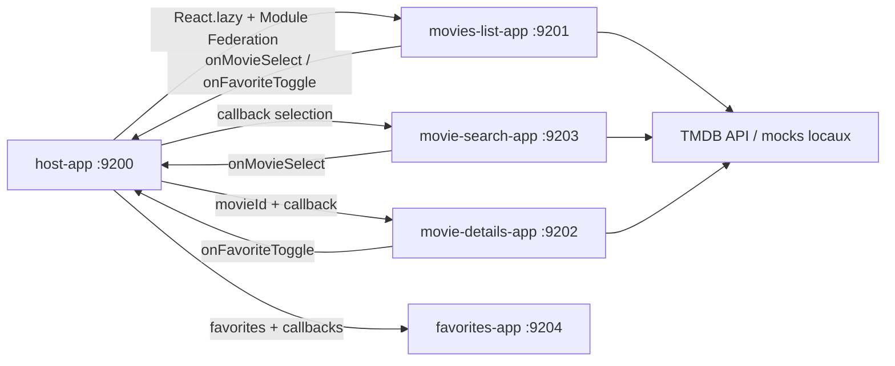

# Movie Platform

Movie Platform est une application Micro-Frontend React 18 construite avec Webpack 5 Module Federation et Bootstrap 5. Elle assemble un Host et quatre Remotes independants pour explorer des films, consulter les details, rechercher dynamiquement et gerer des favoris persistants.

## Cas d'usage

- Afficher des films populaires ou decouverts par genre.
- Rechercher un film avec anti-rebond.
- Selectionner un film et partager cette selection avec les autres Remotes.
- Ajouter et retirer des favoris persistants dans `localStorage`.
- Demonstrer une resilience API avec donnees mockees locales.

## Architecture



## Responsabilites

- **Host** : navigation, orchestration, `selectedMovieId`, favoris partages, persistance, toasts.
- **Movies List App** : films populaires, pagination, filtre par genre, cartes films, selection et favoris.
- **Movie Details App** : affiche, resume, note, genres, duree, date, casting, cartes d'information et bouton favori.
- **Favorites App** : liste des favoris, suppression, compteur, etat vide.
- **Movie Search App** : recherche avec anti-rebond, suggestions, resultats dynamiques, effacement et etat sans resultat.

## APIs utilisees

- TMDB API v3 pour les films populaires, la recherche, les genres, les details et le casting.
- Une cle API est requise pour les appels reels. Sans cle, les mocks locaux prennent le relais automatiquement.

Documentation verifiee :

- https://developer.themoviedb.org/docs/getting-started
- https://developer.themoviedb.org/docs/rate-limiting

## Prerequis

- Node.js 18 ou plus recent.
- npm 9 ou plus recent.
- Ports libres : 9200, 9201, 9202, 9203, 9204.

## Installation

```bash
npm install
npm run install:all
```

## Lancement

```bash
npm run start:all
```

URLs :

- Host : http://localhost:9200
- Movies List : http://localhost:9201
- Movie Details : http://localhost:9202
- Movie Search : http://localhost:9203
- Favorites : http://localhost:9204

## Ports

| Application | Port | Module Federation |
| --- | ---: | --- |
| host-app | 9200 | Consomme les Remotes |
| movies-list-app | 9201 | `moviesListApp/MoviesList` |
| movie-details-app | 9202 | `movieDetailsApp/MovieDetails` |
| movie-search-app | 9203 | `movieSearchApp/MovieSearch` |
| favorites-app | 9204 | `favoritesApp/Favorites` |

## Variables d'environnement

Copier `.env.example` vers `.env` si vous voulez appeler TMDB :

```bash
TMDB_API_KEY=your_key_here
MOVIE_API_TIMEOUT=10000
```

Le fichier `.env` est ignore par Git.

## Commandes disponibles

- `npm run install:all` : installe le Host et les Remotes.
- `npm run start:all` : lance les cinq dev servers.
- `npm run build:all` : build sequentiel, arret immediat en cas d'erreur.

## Captures d'ecran a ajouter

- Host desktop avec details, recherche, favoris et liste.
- Vue mobile de la grille de films.
- Etat fallback local sans cle TMDB.

## Flux de communication

Le projet utilise **props + callbacks**. Le Host conserve `selectedMovieId` et `favorites`. Movies List, Search et Details notifient le Host avec `onMovieSelect` ou `onFavoriteToggle`. Favorites recoit les favoris et demande la suppression avec `onRemoveFavorite`. Les Remotes ne communiquent jamais directement entre elles.

Le Host transmet aussi le film selectionne complet a Movie Details App. Ainsi, si TMDB est absent ou refuse la requete, le Remote Details garde les informations du film choisi au lieu d'afficher un detail generique.

## Gestion des erreurs

- `fetchWithTimeout` utilise `AbortController`.
- Les erreurs HTTP, 401 et 429 ont des messages explicites.
- Chaque Remote affiche loading, empty, error et success states.
- Les mocks locaux garantissent une demo sans cle TMDB ou sans reseau.
- Le Host isole chaque Remote avec un `ErrorBoundary`.

## Limites des APIs

- TMDB requiert une cle API personnelle.
- Les limites actuelles recommandent de rester sous un volume raisonnable et de respecter les reponses `429`.
- Les images TMDB dependent du CDN TMDB; un poster SVG local est utilise en fallback.

## Build

```bash
npm run build:all
```

## Depannage

- Verifier que les ports 9201 a 9204 servent `remoteEntry.js`.
- Verifier que `.env` est a la racine du projet Movie Platform, pas dans une Remote.
- Si la cle TMDB est absente ou invalide, l'interface affiche une alerte et utilise les mocks.
- Si un port est occupe, changer le port dans le `webpack.config.js` concerne et la declaration `remotes` du Host.

## Checklist de validation

- [ ] `npm install`
- [ ] `npm run install:all`
- [ ] `npm run build:all`
- [ ] `npm run start:all`
- [ ] Host visible sur 9200
- [ ] Tous les `remoteEntry.js` accessibles
- [ ] Selection d'un film depuis Movies List
- [ ] Recherche avec anti-rebond
- [ ] Ajout, retrait et persistance des favoris
- [ ] Etats loading, empty, error et fallback verifies
- [ ] Responsive desktop/tablette/mobile verifie

## Pistes d'amelioration

- Ajouter des tests Playwright versionnes.
- Ajouter une page de comparaison de films.
- Ajouter un cache par endpoint.
- Ajouter un store partage versionne pour comparer avec props/callbacks.

## Pourquoi ce projet est utile comme reference Micro-Frontend

Movie Platform montre l'orchestration par Host, la communication par props et callbacks, l'etat partage centralise, l'independance des Remotes, la gestion d'une API avec cle optionnelle, la resilience par mocks, le lazy loading via `React.lazy()`, une UX Bootstrap coherente et des builds independants.
