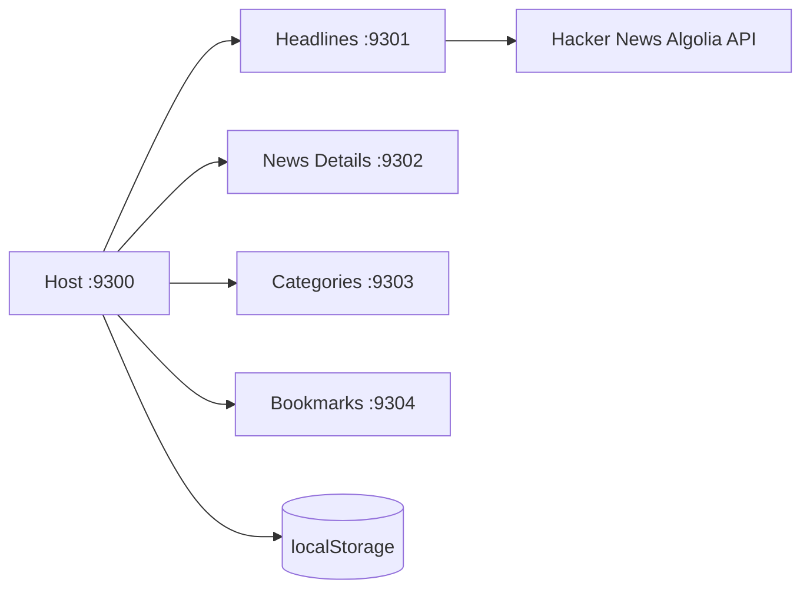

# News Portal

Application editoriale Micro-Frontend construite avec React 18, Webpack 5 Module Federation et Bootstrap 5.

## Cas d'usage

Le Host orchestre une experience d'actualites : titres, categories, lecture detaillee et articles sauvegardes. Chaque Remote peut aussi etre lance seul pour developper ou tester son interface.

## Architecture



Le Host conserve la categorie active, l'article selectionne, les bookmarks et le theme. Les Remotes ne communiquent jamais directement : les donnees passent par props et callbacks.

## Remotes

| Application | Port | Responsabilite | Exposition |
|---|---:|---|---|
| host-app | 9300 | orchestration et navigation | - |
| headlines-app | 9301 | titres, cartes, loading et fallback | `headlinesApp/Headlines` |
| news-details-app | 9302 | detail, source externe et avertissement | `newsDetailsApp/NewsDetails` |
| categories-app | 9303 | filtre editorial | `categoriesApp/Categories` |
| bookmarks-app | 9304 | sauvegarde et suppression locale | `bookmarksApp/Bookmarks` |

## API et resilience

L'API par defaut est Hacker News Algolia, accessible sans cle : `https://hn.algolia.com/api/v1`. Le service applique `AbortController`, un timeout de 10 secondes, le controle `response.ok` et un message lisible. Si le reseau ou l'API echoue, trois articles locaux credibles sont affiches. Le contenu integral peut manquer : le lien vers la source originale est toujours visible.

## Installation et lancement

Prerequis : Node.js 18+ et npm.

```powershell
npm.cmd install
npm.cmd run install:all
npm.cmd run start:all
```

Ouvrir `http://localhost:9300`. Pour lancer un seul Remote : `npm.cmd --prefix headlines-app start`.

## Variables d'environnement

`.env.example` documente `NEWS_API_BASE_URL`, `NEWS_API_TIMEOUT` et `NEWS_API_KEY`. La cle est reservee à une eventualite de fournisseur externe ; l'API par defaut ne demande aucune cle. `.env` est ignore par Git.

## Commandes et build

```powershell
npm.cmd run build:all
```

Le build est sequentiel pour rendre les logs lisibles et arreter immediatement en cas d'erreur. Les warnings de taille Webpack ne bloquent pas la compilation.

## Accessibilite et securite

Les formulaires et boutons sont etiquetes, les images ont un texte alternatif, le focus clavier reste visible et les liens externes utilisent `rel="noopener noreferrer"`. Aucun HTML brut n'est injecte et aucune cle n'est committee.

## Captures d'ecran a ajouter

- Vue Host desktop avec titres et detail.
- Vue mobile avec menu responsive.
- Mode sombre et liste des bookmarks.
- Etat fallback lorsque l'API est indisponible.

## Depannage

- Si un port est occupe, arreter le processus existant puis relancer `npm.cmd run start:all`.
- Si les titres ne repondent pas, le fallback local doit apparaitre avec une alerte explicite.
- Si un Remote affiche un ecran de chargement permanent, verifier que son `remoteEntry.js` repond sur le port correspondant.

## Checklist de validation

- [x] Host et quatre Remotes independants.
- [x] Lazy loading et Suspense.
- [x] Etats loading, erreur, vide et succes.
- [x] API publique sans cle et fallback local.
- [x] Bookmarks persistants dans localStorage.
- [x] Build independant de chaque application.
- [x] Responsive Bootstrap et focus clavier.

## Pourquoi ce projet est utile comme reference Micro-Frontend

Il montre l'orchestration d'une experience editoriale, la communication Host/Remote par props et callbacks, l'etat partage minimal, l'independance des Remotes, la resilience API, le lazy loading, une UX coherente et le build independant de chaque surface.

## Pistes d'amelioration

Ajouter un fournisseur RSS cote serveur, une pagination multi-categorie, des tests d'integration Module Federation, une authentification utilisateur et une couche de cache partagee.
