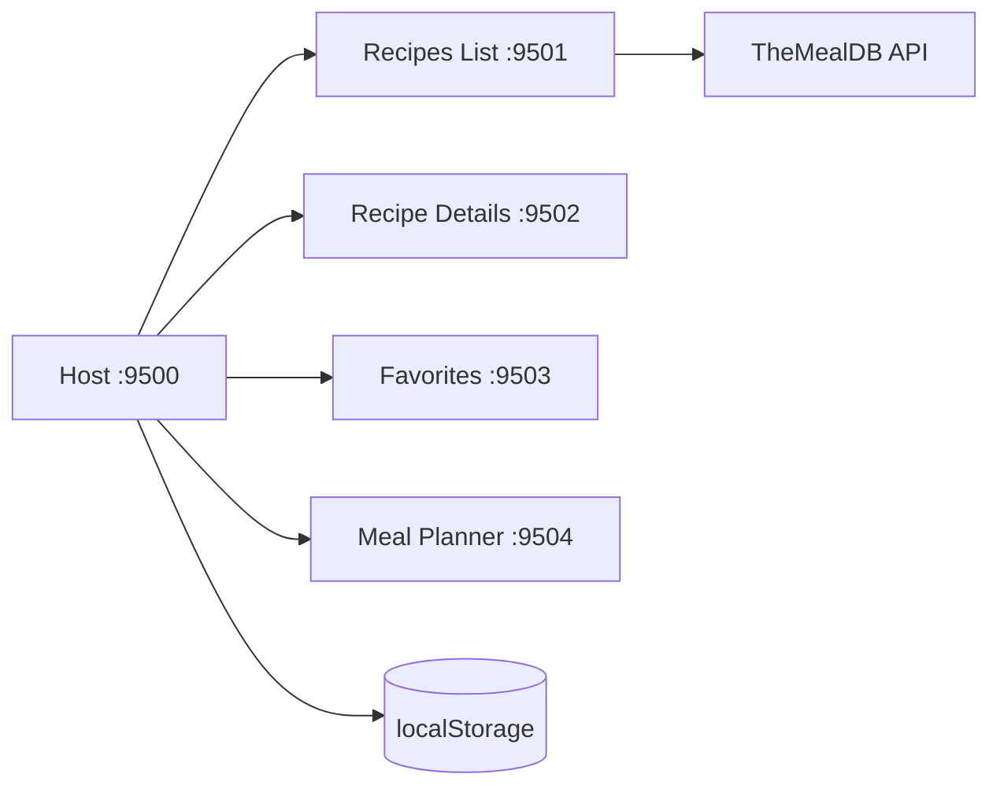

# Recipes App

Reference Micro-Frontend de cuisine avec React 18, Webpack 5 Module Federation et Bootstrap 5.

## Architecture



Le Host conserve la recette selectionnee, les favoris et le planning. Les Remotes restent independants et communiquent uniquement par props et callbacks.

| Application | Port | Exposition |
|---|---:|---|
| host-app | 9500 | orchestration |
| recipes-list-app | 9501 | `recipesListApp/RecipesList` |
| recipe-details-app | 9502 | `recipeDetailsApp/RecipeDetails` |
| favorites-app | 9503 | `favoritesApp/Favorites` |
| meal-planner-app | 9504 | `mealPlannerApp/MealPlanner` |

## Fonctionnalites

Recherche, categories, cartes avec images, detail ingredients/instructions, lien video, favoris locaux et planning lundi-dimanche persistant. Le bouton Planifier ajoute la recette au lundi dans ce parcours de demonstration ; le Remote planner expose les sept jours et permet de changer le jour actif.

## API et limites

TheMealDB propose une cle de test gratuite `1` pour les projets d'apprentissage. Les endpoints V1 utilises sont recherche, lookup details et filtres categorie. La couche API met un timeout AbortController, controle HTTP et fallback local. Les fonctions premium et les limites de production ne sont pas utilisees. Documentation officielle : https://themealdb.com/docs_api_guide.php.

## Installation et commandes

```powershell
npm.cmd install
npm.cmd run install:all
npm.cmd run start:all
npm.cmd run build:all
```

Host : `http://localhost:9500`. Les Remotes sont sur 9501 a 9504. Chaque application peut etre lancee seule avec `npm.cmd --prefix recipes-list-app start`.

## Environnement

`.env.example` documente `MEALDB_API_BASE_URL` et `MEALDB_API_TIMEOUT`. Le test key `1` est inclus dans l'URL publique de developpement, aucun secret personnel n'est committe. `.env` est ignore par Git.

## UX, accessibilite et resilience

Loading, erreur, empty state et succes sont presentes. Les controles ont des labels, les images un alt, le focus clavier est visible et les liens video utilisent `noopener noreferrer`. React echappe les textes et aucun paiement ni donnee sensible n'est gere.

## Captures d'ecran a ajouter

- liste responsive et filtres ;
- detail avec ingredients ;
- favoris ;
- planning hebdomadaire ;
- fallback local API.

## Pourquoi ce projet est utile comme reference Micro-Frontend

Il montre l'orchestration, la selection partagee, les callbacks, l'independance des Remotes, la resilience API, le lazy loading, la persistence locale, une UX coherente et les builds independants.

## Checklist et ameliorations

Verifier les cinq ports, les quatre `remoteEntry.js`, recherche, categorie, detail, favoris, planning, localStorage et responsive. Pour aller plus loin : ajouter drag-and-drop, portions, liste de courses, nutrition, tests E2E et authentification.
