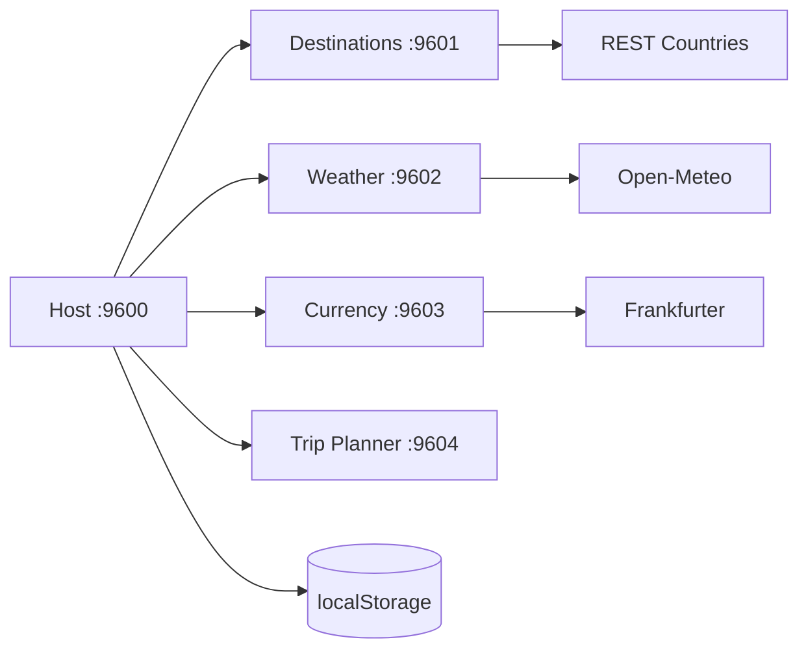

# Travel Dashboard

Reference Micro-Frontend de preparation de voyage avec React 18, Webpack 5 Module Federation et Bootstrap 5.

## Architecture



Le Host conserve la destination et le planning. Les Remotes restent independants et communiquent par props et callbacks.

| Application | Port | Exposition |
|---|---:|---|
| host-app | 9600 | orchestration |
| destinations-app | 9601 | `destinationsApp/Destinations` |
| weather-app | 9602 | `weatherApp/Weather` |
| currency-app | 9603 | `currencyApp/Currency` |
| trip-planner-app | 9604 | `tripPlannerApp/TripPlanner` |

## Fonctionnalites

Recherche de pays, drapeau, capitale, region, langues et devise ; meteo actuelle et previsions ; conversion monetaire ; dates, notes et checklist persistantes.

## APIs et limites

REST Countries fournit les informations de pays, Open-Meteo fournit les previsions sans cle et Frankfurter fournit les taux quotidiens. Les endpoints sont verifies dans les documentations officielles : https://restcountries.com/docs/countries, https://open-meteo.com/en/docs et https://frankfurter.dev/. Chaque service applique timeout, erreurs HTTP et fallback local. REST Countries peut demander une authentification selon la version/deploiement : le projet conserve donc un fallback demonstrable.

## Installation et commandes

```powershell
npm.cmd install
npm.cmd run install:all
npm.cmd run start:all
npm.cmd run build:all
```

Host : `http://localhost:9600`. Les Remotes sont sur 9601 a 9604.

## Variables d'environnement

`.env.example` documente les bases API et `TRAVEL_API_TIMEOUT`. Les APIs choisies ne necessitent pas de secret dans ce projet ; `.env` est ignore par Git.

## UX, accessibilite et resilience

Loading, erreurs, empty states et fallback local sont affiches. Les champs ont des labels, les drapeaux un alt, le focus clavier reste visible et les donnees saisies sont conservees localement.

## Captures a ajouter

- recherche de destination ;
- meteo et conversion ;
- planning avec checklist ;
- fallback d'une API ;
- responsive mobile.

## Pourquoi ce projet est utile comme reference Micro-Frontend

Il demontre l'orchestration, la selection partagee, l'integration de plusieurs APIs independantes, la resilience, le lazy loading, la persistence locale, l'UX coherente et les builds autonomes.

## Checklist et ameliorations

Verifier les cinq ports, les quatre `remoteEntry.js`, recherche, selection, meteo, taux, checklist et localStorage. Ajouter ensuite geocodage Nominatim avec respect du rate limit, carte, fuseaux horaires et tests E2E.
