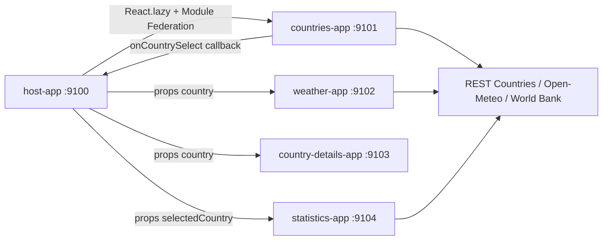

# World Dashboard

World Dashboard est une application Micro-Frontend pedagogique construite avec React 18, Webpack 5 Module Federation et Bootstrap 5. Elle assemble un Host et quatre Remotes independants pour explorer des pays, consulter la meteo d'une capitale, lire les details d'un pays et comparer des statistiques.

## Cas d'usage

- Explorer une liste de pays avec recherche, filtre par continent et pagination.
- Selectionner un pays dans Countries App.
- Afficher automatiquement ses details, sa meteo et ses statistiques dans les autres Remotes.
- Demonstrer une architecture resiliente avec APIs publiques et donnees mockees locales.

## Architecture



## Responsabilites

- **Host** : navigation globale, orchestration des Remotes, recherche globale, etat `selectedCountry`, integration via `React.lazy()` et `Suspense`.
- **Countries App** : liste, recherche locale, filtre par continent, pagination, callback de selection.
- **Weather App** : meteo actuelle et previsions simples pour la capitale selectionnee.
- **Country Details App** : fiche detaillee autonome du pays selectionne.
- **Statistics App** : comparaison de population et superficie, integration optionnelle World Bank.

## APIs utilisees

- REST Countries v3.1 : pays, drapeaux, capitales, regions, population, langues et monnaies.
- Countries dataset public GitHub : source distante de secours lorsque REST Countries refuse la requete ou change sa politique d'acces.
- Open-Meteo Forecast API : meteo actuelle, humidite, vent et previsions. Aucune cle necessaire pour l'usage de demonstration.
- World Bank API : indicateur `SP.POP.TOTL` pour la population. Aucune cle necessaire.

Chaque service passe par `src/services/api.js`, utilise `fetchWithTimeout(url, options, timeout)`, `AbortController`, verification `response.ok`, erreurs lisibles et fallback local.

## Prerequis

- Node.js 18 ou plus recent.
- npm 9 ou plus recent.
- Ports libres : 9100, 9101, 9102, 9103, 9104.

## Installation

```bash
npm install
npm run install:all
```

## Lancement

```bash
npm run start:all
```

Puis ouvrir :

- Host : http://localhost:9100
- Countries : http://localhost:9101
- Weather : http://localhost:9102
- Country Details : http://localhost:9103
- Statistics : http://localhost:9104

## Ports

| Application | Port | Module Federation |
| --- | ---: | --- |
| host-app | 9100 | Consomme les Remotes |
| countries-app | 9101 | `countriesApp/Countries` |
| weather-app | 9102 | `weatherApp/Weather` |
| country-details-app | 9103 | `countryDetailsApp/CountryDetails` |
| statistics-app | 9104 | `statisticsApp/Statistics` |

## Variables d'environnement

Voir `.env.example`. Aucune cle API n'est requise. Le fichier `.env` est ignore par Git.

## Commandes disponibles

- `npm run install:all` : installe les dependances du Host et des Remotes.
- `npm run start:all` : lance les cinq dev servers.
- `npm run build:all` : build sequentiel du Host puis des Remotes.

## Captures d'ecran a ajouter

- Vue desktop du Host avec les quatre Remotes.
- Vue mobile de la liste des pays.
- Etat fallback local lorsque l'API distante ne repond pas.

## Flux de communication

Le choix principal est **props + callbacks**. Countries App emet `onCountrySelect(country)`; le Host met a jour `selectedCountry`; Weather, Details et Statistics recoivent la selection par props. Le Host emet aussi un evenement personnalise `world-dashboard:country-selected` pour illustrer un canal evenementiel non couplant, sans communication directe entre Remotes.

## Gestion des erreurs

- `fetchWithTimeout` annule les requetes lentes avec `AbortController`.
- Les erreurs HTTP produisent des messages utilisateurs comprehensibles.
- Chaque Remote affiche loading, empty, error et success states.
- Les Remotes restent demonstrables via `mockData.js`.
- Le Host entoure chaque Remote avec un `ErrorBoundary`.

## Limites des APIs

- REST Countries peut changer de politique d'acces ou limiter certains endpoints.
- Open-Meteo est gratuit pour des usages raisonnables, mais soumis a ses conditions et quotas.
- World Bank peut renvoyer des donnees manquantes selon le pays ou l'annee.
- Le projet n'inclut aucune cle API et ne journalise aucun secret.

## Build

```bash
npm run build:all
```

La commande est sequentielle pour arreter immediatement en cas d'echec et garder des logs lisibles.

## Depannage

- Si le Host n'affiche pas les Remotes, verifier que les ports 9101 a 9104 servent bien `remoteEntry.js`.
- Si une API echoue, l'UI affiche une alerte et utilise les mocks locaux.
- Si REST Countries echoue, l'application essaie d'abord un dataset pays public distant avant de tomber sur les mocks locaux.
- Si un port est occupe, modifier le port correspondant dans `webpack.config.js` et la declaration `remotes` du Host.
- Supprimer `node_modules` et relancer `npm run install:all` en cas de dependances corrompues.

## Checklist de validation

- [ ] `npm install`
- [ ] `npm run install:all`
- [ ] `npm run build:all`
- [ ] `npm run start:all`
- [ ] Host visible sur 9100
- [ ] Tous les `remoteEntry.js` accessibles
- [ ] Selection d'un pays depuis Countries App
- [ ] Weather, Details et Statistics mis a jour
- [ ] Etats loading, empty, error et fallback verifies
- [ ] Responsive desktop/tablette/mobile verifie

## Pistes d'amelioration

- Ajouter des tests Playwright automatises.
- Ajouter un cache applicatif par API.
- Ajouter des graphiques avec une librairie dediee.
- Ajouter un store partage versionne pour comparer avec l'approche props/callbacks.

## Pourquoi ce projet est utile comme reference Micro-Frontend

Ce projet montre l'orchestration par Host, la communication par props et callbacks, l'etat partage centralise, l'independance des Remotes, la gestion d'APIs publiques, la resilience avec fallbacks, le lazy loading via `React.lazy()`, une UX coherente Bootstrap et un build independant pour chaque application.
